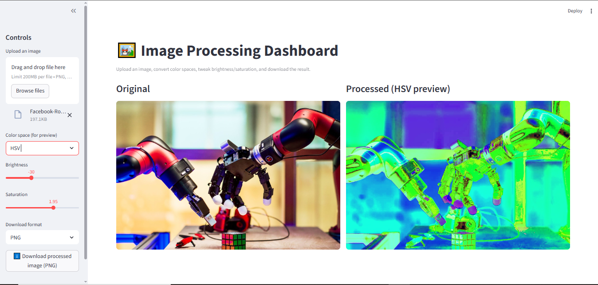

# CV Image Processing Dashboard

An interactive computer vision dashboard built with Streamlit and OpenCV. Upload an image, explore how it looks across different color spaces, adjust brightness and saturation in real time, and download the processed result — all through a simple browser-based UI with no coding required to use it.

This project was built as a hands-on exercise in applying core computer vision concepts (color space theory, pixel-level image manipulation) through a real, deployable tool rather than just isolated notebook exercises.

---

## Table of Contents

- [Features](#features)
- [Demo](#demo)
- [Tech Stack](#tech-stack)
- [How It Works](#how-it-works)
- [Project Structure](#project-structure)
- [Setup & Installation](#setup--installation)
- [Usage](#usage)
- [Key Concepts Demonstrated](#key-concepts-demonstrated)
- [Known Limitations](#known-limitations)
- [Future Improvements](#future-improvements)
- [Author](#author)

---

## Features

- **Image upload** — supports PNG, JPG, JPEG, BMP, and WEBP formats
- **Color space conversion** — view the same image rendered in RGB, BGR, or HSV
- **Brightness adjustment** — live slider, range -100 to +100
- **Saturation adjustment** — live slider, range 0.0 (grayscale) to 3.0 (highly saturated)
- **Side-by-side comparison** — original vs. processed image shown together
- **Downloadable output** — export the final processed image as PNG or JPEG

---

## Demo


---

## Tech Stack

| Tool | Purpose |
|---|---|
| [Streamlit](https://streamlit.io/) | Web app framework — handles UI, file upload, sliders, live preview, and download button |
| [OpenCV](https://opencv.org/) | Color space conversion and pixel-level brightness/saturation processing |
| [NumPy](https://numpy.org/) | Underlying array operations for all image data |
| [Pillow (PIL)](https://python-pillow.org/) | Image loading and final encoding for download |

---

## How It Works

1. **Upload & load** — The uploaded file is opened via Pillow and converted into a NumPy RGB array (`height × width × 3`).
2. **Brightness adjustment** — Applied using `cv2.convertScaleAbs()`, which adds a scalar offset to every pixel value and clips the result to a valid 0–255 range.
3. **Saturation adjustment** — The image is converted to HSV, the Saturation channel is scaled by the chosen factor (clipped to stay within 0–255), and the image is converted back to RGB. Saturation is only adjusted in HSV space because HSV separates color intensity (Hue) from color purity (Saturation) and brightness (Value) — RGB doesn't allow this kind of targeted adjustment.
4. **Color space preview** — For display purposes only, the processed RGB image can additionally be converted to BGR or HSV so users can see what the same pixel data looks like in each representation. (Note: BGR/HSV arrays displayed directly will look visually "wrong" to the eye — this is expected, since you're viewing the raw values of a color space the human eye isn't calibrated to interpret directly.)
5. **Download** — The final RGB-adjusted image (never the BGR/HSV preview array) is encoded into real PNG/JPEG bytes via Pillow and an in-memory buffer (`io.BytesIO`), then served through Streamlit's download button.

---

## Project Structure

```
image-dashboard-project/
├── image_dashboard.py     # Main Streamlit application
├── requirements.txt        # Python dependencies
├── .gitignore
└── README.md
```

---

## Setup & Installation

### Prerequisites
- Python 3.9 or higher
- pip

### Steps

```bash
# Clone the repository
git clone https://github.com/Vickyenz/Image-Processing-Dashboard.git
cd Image-Processing-Dashboard

# Create a virtual environment
python -m venv venv

# Activate it
venv\Scripts\Activate.ps1      # Windows PowerShell
source venv/bin/activate       # macOS/Linux

# Install dependencies
pip install -r requirements.txt

# Run the app
streamlit run image_dashboard.py
```

The app will open automatically in your browser at `http://localhost:8501`. If it doesn't, copy the URL printed in your terminal.

---

## Usage

1. Launch the app (see above)
2. Use the sidebar to upload an image
3. Select a color space to preview (RGB / BGR / HSV)
4. Adjust the **Brightness** and **Saturation** sliders and watch the preview update live
5. Choose your download format (PNG or JPEG)
6. Click **Download processed image** in the sidebar

---

## Key Concepts Demonstrated

This project was built specifically to practice and demonstrate:
- Color space theory (why HSV exists, and why it's the right space for saturation edits)
- Vectorized NumPy operations vs. manual pixel loops
- Safe numeric handling when scaling pixel values (`float32` casting before math, `np.clip()` to prevent overflow, `uint8` casting before display/save)
- The distinction between an in-memory NumPy array and an actual encoded file (PNG/JPEG bytes), and how to bridge the two using Pillow and `io.BytesIO`
- Building and deploying a functional tool with Streamlit, rather than only working in notebooks

---

## Known Limitations

- Very large image files may slow down live slider responsiveness, since every slider movement re-runs the full processing pipeline
- No undo/reset button yet — refreshing the page is currently the only way to start over
- BGR/HSV preview mode is for educational/visual purposes only; it does not represent how the image would look when opened normally in an image viewer

---

## Future Improvements

- [ ] Contrast adjustment
- [ ] Image rotation and flipping
- [ ] Additional filters (Gaussian blur, sharpening, edge detection via Canny)
- [ ] Reset-to-original button
- [ ] Batch processing for multiple uploaded images
- [ ] Histogram display for brightness/saturation distribution

---

## Author

Built by [Victor (Vickyenz)](https://github.com/Vickyenz) as part of an ongoing computer vision and machine learning portfolio, alongside a broader mechatronics engineering + AI/ML specialization track.